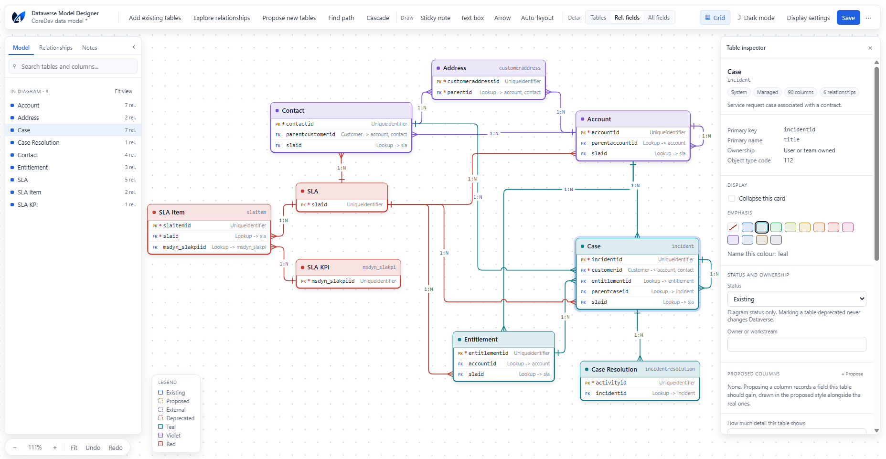
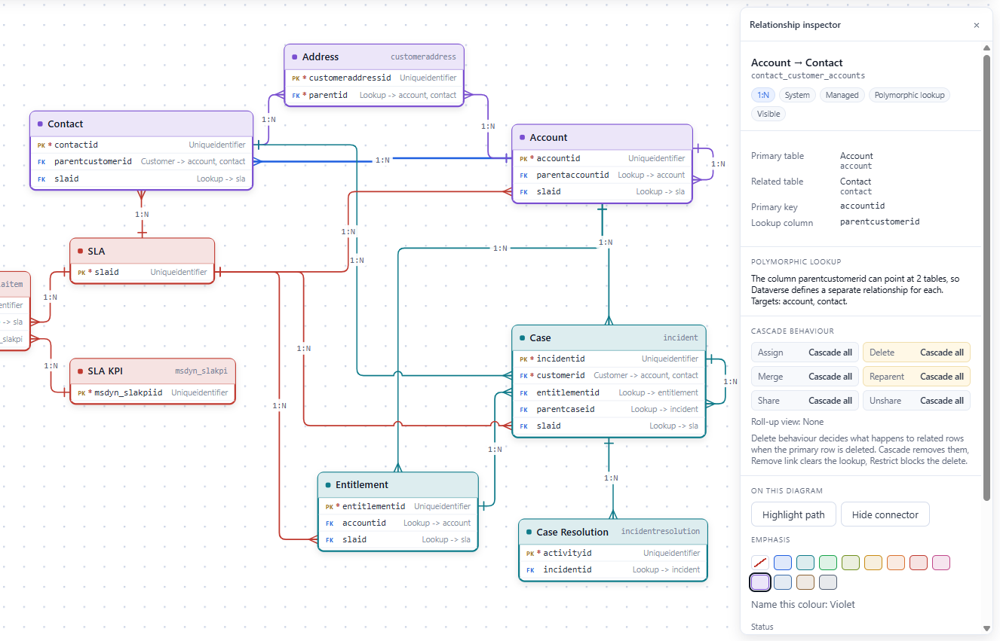
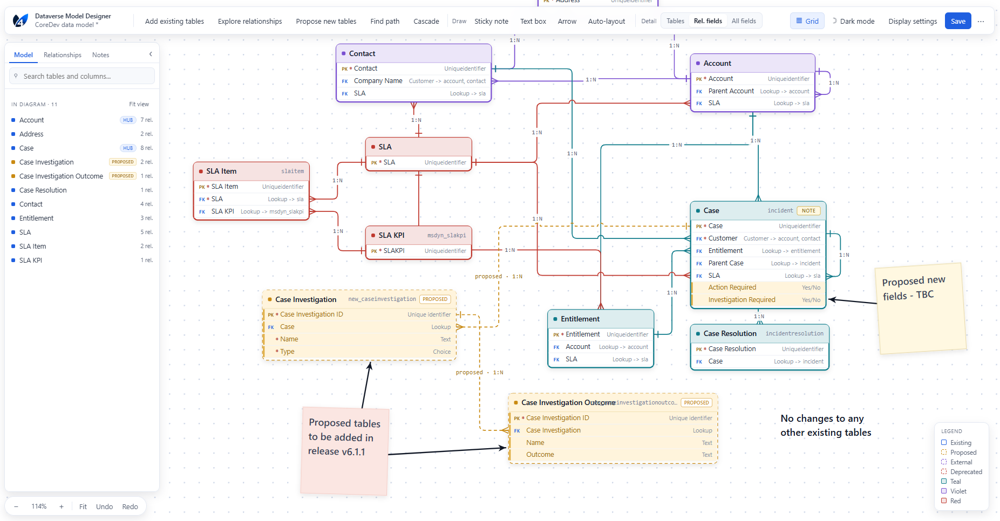

# Dataverse Model Designer

An XrmToolBox tool for exploring, designing and documenting a Microsoft Dataverse data model.

It is more than an ERD exporter. It supports the whole journey:

```
Dataverse metadata -> explore -> select -> understand -> design -> annotate -> save / export
```

**The tool only ever reads metadata. It never writes to your environment.** Removing a table from
a diagram, marking something deprecated, or designing a proposed table are all diagram-level
actions held in the diagram file. Nothing is created, changed or deleted in Dataverse.


---

## Screenshots





---

## What it does

| Area | Capability |
|---|---|
| **Sources** | Start a diagram from a solution, from tables you pick by hand, from a blank canvas, or from a saved file. One question per step. |
| **Exploring** | Start from one table and walk outwards to a chosen depth, grouped by hop. Filters for relationship direction, N:N, Microsoft-supplied tables, activity tables, intersect tables and platform plumbing. Results are reviewed before anything is added. |
| **Relationships** | Discovers 1:N, N:1 and N:N between the tables on the canvas, including between tables you are adding and tables already there. Multiple relationships between the same pair stay individually selectable and are fanned out visually. |
| **Detail levels** | Tables only, relationship columns, or all columns, with per-table overrides and independent toggles for display names, schema names, types, key markers, cardinality and cascade. |
| **Canvas** | Pan, zoom in 5% steps or to a preset, drag, marquee select, snap, undo and redo, five automatic layouts, draggable connectors with line jumps, and twelve emphasis colours that can each be given a name that appears in the legend and in exports. The legend is draggable and its position is saved with the diagram. |
| **Annotation** | Sticky notes (resizable, rotatable, optionally attached to a table or a connector with a leader line), text boxes and arrows. Each can be drawn in front of the model or behind it, and all of them reach the picture exports. |
| **Inspection** | Relationship inspector showing schema name, cardinality, participating tables, primary key, lookup column, custom or system, polymorphic targets and the full assign / delete / merge / reparent / share / unshare cascade configuration. Table inspector shows how records are owned. |
| **Design** | Propose a new table, a column on an existing table, a relationship between any two tables, or an external system. Proposed, external and deprecated objects are distinguished by border pattern, badge and colour together. A proposed one-to-many writes the lookup column it implies onto the table at the many end and draws the connector to that row. |
| **Search** | Searches both the diagram and the environment. Matching columns appear as their own results, and a table found elsewhere can be added straight to the canvas with its relationships. |
| **Analysis** | Cascade impact analysis (what deleting or reassigning one record reaches, what would refuse the operation, what merely loses its link), a relationship path finder between two tables, hub and orphan indicators, and multiple-relationship detection. |
| **Persistence** | Save and reopen `.dvmd` diagrams. Refresh against Dataverse with a found / changed / missing review, and explicit confirmation before a proposed object is promoted to existing. |
| **Export** | PNG, SVG, draw.io, Mermaid and Visio (experimental), plus documentation as Azure DevOps wiki Markdown or a self-contained HTML page. Every format states what it cannot carry before you choose a filename. |
| **Appearance** | Light and dark themes, remembered across sessions. The command bar sheds one control at a time into an overflow menu as the window narrows, so nothing becomes unreachable. |

---

## Requirements

- XrmToolBox 1.2025.10.74 or later
- .NET Framework 4.8
- Microsoft Edge WebView2 Runtime

WebView2 ships with Windows 11 and is present on most managed Windows 10 estates, and XrmToolBox
itself depends on it. If the tool reports a missing runtime, install the Evergreen WebView2
Runtime and restart XrmToolBox.

---

## Installation

The tool is distributed as a single assembly. It is not published to the XrmToolBox Tool Library,
so installation is a file copy.

1. Close XrmToolBox. It locks plugin assemblies while it is running.
2. Download `Oliver4.DataverseModelDesigner.dll` from the
   [latest release](https://github.com/oliver4-devtools/dataverse-model-designer/releases/latest).
3. Copy it into your XrmToolBox plugins folder:

   ```
   %APPDATA%\MscrmTools\XrmToolBox\Plugins
   ```

4. Windows marks downloaded files as blocked, and XrmToolBox skips a blocked assembly silently.
   Clear that in PowerShell:

   ```powershell
   Unblock-File "$env:APPDATA\MscrmTools\XrmToolBox\Plugins\Oliver4.DataverseModelDesigner.dll"
   ```

   You can also right-click the file, choose Properties, and tick **Unblock**.

5. Start XrmToolBox. **Dataverse Model Designer** appears in the tool list.

Copy only this one DLL. Nothing else is needed, and XrmToolBox already ships the Dataverse SDK,
WebView2 and Newtonsoft.Json assemblies the project builds against.

If the tool does not appear, check the XrmToolBox logs at
`%APPDATA%\MscrmTools\XrmToolBox\Logs`, where plugin discovery failures are recorded.

### Updating

Close XrmToolBox, overwrite the DLL with the new one, unblock it, and start XrmToolBox again.

### Uninstalling

Close XrmToolBox and delete the DLL from the plugins folder. Your `.dvmd` files are unaffected.

---

## Getting started

1. Connect to an environment in XrmToolBox and open the tool. The new diagram wizard opens
   straight away.
2. Pick a source: a solution, tables chosen by hand, a blank canvas, or an existing `.dvmd` file.
3. Choose which relationships to include from the review list.
4. Set the detail level for the whole diagram, then override individual tables where it helps.
5. Lay it out, add emphasis colours, notes and labels.
6. Save the diagram, or export a picture or the documentation.

A **What this tool can do** guide is available from the overflow menu in the command bar, covering
each area in plain language.

---

## Diagram files

Diagrams are saved as `.dvmd`, a JSON file that describes the tables, relationships, layout,
settings and annotations. Because it is plain JSON, a diagram can sit in source control alongside
the solution it documents.

The current file format is version 2. Version 1 files are upgraded when opened, and you are told
when that happens. A version 2 file cannot be opened by an earlier build of the tool.

Refreshing a diagram compares it with the live environment and reports what was found, what
changed and what is missing. Nothing proposed is ever promoted to existing without confirmation.

---

## Known limits

- **Visio export is experimental.** It writes Visio 2003 XML (`.vdx`) rather than `.vsdx`. Each
  table is one shape with its columns as text rather than separately selectable rows, and drawn
  arrows are left out. The export dialog says so before you choose a filename. Check the output
  opens as you expect before relying on it.
- **Documentation export is Markdown or HTML, not `.docx`.** A Word writer would mean shipping a
  second assembly and breaking the single-DLL install. Word opens the HTML export, and the
  Markdown pastes into a wiki.
- **Cascade impact reports what metadata says, not what will happen.** It follows the configured
  behaviour on each relationship. It does not know whether child records exist, and plugins or
  custom logic that run on delete are invisible to it. Bounded to 200 tables and 10 hops.
- **Exploring and path finding are bounded.** Exploring defaults to a 150-table ceiling (capped at
  400) and a maximum depth of 8. Path finding is bounded by hop count and a 400-table expansion
  budget. Both say when a limit stopped them.
- **The platform-table filter is a judgement call, not metadata.** Dataverse has no flag for "this
  table is plumbing", so the list is maintained by name and the filter can be switched off.
- **Ownership is not modelled for proposed tables.** A table that does not exist yet has no
  ownership, so the marker is drawn only for tables that came from the environment.
- **Polymorphic lookups** (Customer, Owner, Regarding) produce one Dataverse relationship per
  target. All are shown, and the inspector explains why.
- **Accessibility.** Status is carried by border pattern, badge text and colour together, never
  colour alone. Keyboard operation covers selection, deletion, zoom, fit, undo and redo, save,
  open and export. Full keyboard traversal of the canvas and screen-reader support are not yet
  done.

---

## Privacy and security

- **Metadata only, read only.** The tool reads Dataverse metadata through the connection
  XrmToolBox already holds. It never writes to the environment and it reads no records.
- **No calls of its own.** The assembly contains no HTTP client of any kind: no update check, no
  licence check, no analytics, no telemetry. Nothing is sent anywhere.
- **The canvas cannot reach the network.** It is a web application compiled into the assembly and
  served from memory over a private virtual origin, under a Content-Security-Policy of
  `default-src 'none'; script-src 'self'; connect-src 'none'; form-action 'none'`, so no script in
  it can open a connection even if one were introduced.
- **Links open in your browser.** Choosing Help or a link inside the tool hands the URL to Windows,
  which opens your default browser at github.com. That is the only outbound traffic the tool
  causes, and it only happens when you click.
- **Files.** Nothing is written to disk except the diagram and export files you choose to save,
  plus the tool's own settings, which XrmToolBox stores with its other tool settings.

---

## How it is built

XrmToolBox tools are WinForms. The canvas here is not: it is an SVG document rendered by an
embedded WebView2 control, with the WinForms shell handling the Dataverse connection, file dialogs
and settings.

That buys three things:

- **One drawing, three outputs.** What is on screen, what the SVG export writes and what the PNG
  export rasterises are the same SVG. There is no second renderer to keep in step.
- **Interaction for free.** Pan, zoom, hit testing, text measurement and CSS-quality styling are
  browser primitives rather than thousands of lines of custom painting.
- **A simple install.** WebView2 already ships with XrmToolBox, so the package is one assembly.

```
ModelDesignerControl (WinForms)       connection, dialogs, settings, resource serving
        |
   HostBridge  <--- JSON over CoreWebView2.PostWebMessage --->  bridge.js
        |                                                            |
  MetadataService   DiscoveryService   RefreshService          state.js (the document)
  ExportService     DiagramFile                                geometry.js  layout.js
                                                               render.js (SVG canvas)
```

The host owns Dataverse and the file system. The canvas owns the document, and the JSON it holds
is exactly what a `.dvmd` file contains. Every host call runs off the UI thread, so a slow
metadata request never freezes the tab.

---

## Building from source

Requires the .NET SDK and access to nuget.org for the first restore. Visual Studio 2022 works,
and is not required.

```
dotnet restore
dotnet build src/Oliver4.DataverseModelDesigner -c Release
```

The output to deploy is the single file
`src/Oliver4.DataverseModelDesigner/bin/Release/Oliver4.DataverseModelDesigner.dll`. Do not copy
the rest of the build output into the XrmToolBox plugins folder: it contains assemblies
XrmToolBox already ships, and overwriting those is the usual cause of a tool that fails to appear.

The project targets .NET Framework 4.8 and builds on macOS and Linux as well as Windows, but it
can only run on Windows, inside XrmToolBox.

### Verification

The `verify` folder holds checks that need no NuGet access:

```
cd verify && dotnet run --project Verify.csproj      # exporters, serialisation, row rules
cd verify/js && node canvas-smoke.mjs                # canvas state, layout, routing, SVG export
```

The C# checks compile the real source against local stubs of XrmToolBox, the Dataverse SDK,
WebView2 and Newtonsoft.Json. The canvas checks run the web modules under a minimal DOM shim and
finish by loading the document the C# checks serialised, which proves both runtimes agree on the
wire format. Neither is a substitute for building and running against the real packages.

